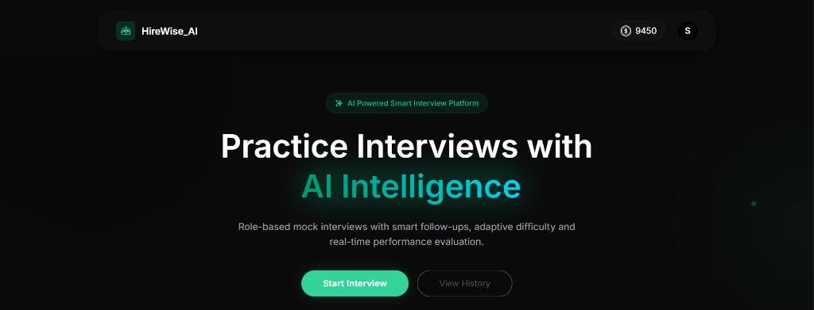
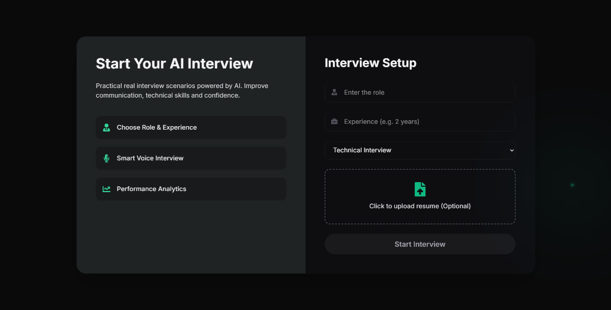

<div align="center">
  
  # 🤖 HireWise AI 
  **Your Personal AI-Powered Mock Interview Platform**

  [](#)
  [](#)
  [](#)
  [](#)
  [](#)
  [](#)
  
  <p align="center">
    Role-based mock interviews with smart follow-ups, adaptive difficulty, and real-time performance evaluation.
  </p>

</div>

---

## ✨ Project Showcase

*(Place your screenshots in a `docs/` folder in your project root to activate these images!)*

<div align="center">
  
  
  
</div>

---

## 🚀 Key Features

* **🎙️ Smart Voice Interviews**: Engage in real-time, dynamic conversations with an AI that adapts its follow-up questions intelligently based on your resume and previous answers.
* **💼 Role-Based Scenarios**: Choose specific roles (Frontend, Backend, Data Science) and exact experience levels to generate highly accurate, technical interview simulations.
* **📄 Automated Resume Parsing**: Upload your PDF resume securely. Our AI (powered by `pdfjs-dist` and `multer`) extracts your skills and projects to tailor the interview directly to your background.
* **📊 Performance Analytics & Dashboard**: Review your entire interview history. Receive calculated scores on *Confidence*, *Communication*, and *Correctness*, along with deep AI feedback mapping exactly where you succeeded and where to improve.
* **💳 Premium Credit System**: Built-in credential tracking and secure top-ups integrated with Razorpay.
* **✨ Cinematic UI/UX**: Overhauled with Framer Motion and Tailwind CSS v4 to deliver a "Linear-tier", smooth dark-mode experience featuring magnetic physics buttons, 3D tracking cards, and an animated generative mesh environment.

---

## 🛠️ Technology Stack

### Frontend (Client)
* **Core**: React 19, Vite, React Router v7
* **Styling & UX**: Tailwind CSS v4 (Custom Dark Mode), Motion (Framer Motion)
* **State Management**: Redux Toolkit
* **Data Visualization**: Recharts, React Circular Progressbar
* **Export Utilities**: jsPDF (for generating downloadable Interview Reports)

### Backend (Server)
* **Architecture**: Node.js, Express.js
* **Database**: MongoDB (Mongoose ORM)
* **Authentication**: JWT (JSON Web Tokens), Cookie Parser
* **File Handling**: Multer (Upload handling), PDF.js (Parsing internal documents)
* **Payments**: Razorpay Gateway

---

## 💻 Running Locally

### 1. Clone the repository
```bash
git clone https://github.com/sidV214/HireWise_AI.git
cd HireWise_AI
```

### 2. Environmental Variables setup
Create `.env` files in both the `client/` and `server/` directories using the `.env.example` templates (Ensure you bind your Razorpay, MongoDB, and AI API keys locally).

### 3. Install Dependencies
```bash
# Install Backend Dependencies
cd server
npm install

# Install Frontend Dependencies
cd ../client
npm install
```

### 4. Boot Up Servers
You will need two terminal windows:

**Terminal 1 (Backend):**
```bash
cd server
npm run dev
```

**Terminal 2 (Frontend):**
```bash
cd client
npm run dev
```

Visit `http://localhost:5173` to experience the platform.
